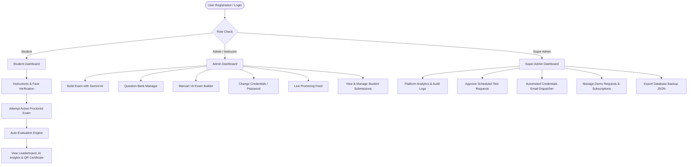

# Examin - Online Examination System 🎓


Comprehensive documentation for the **Examin** platform, detailing system architecture, user workflows, proctoring security, database models, AI exam generation, API specifications, and deployment guidelines.

---

## 📌 Project Overview

**Examin** is an enterprise-grade full-stack web application designed for educational institutions, schools, and corporate certifiers to conduct secure online examinations. It features **real-time Google Gemini AI question generation**, **AI-assisted exam builder**, **automated MCQ grading**, **leaderboard rankings**, **QR-verified certificate issuance**, **live proctor monitoring**, and **super admin platform oversight**.

---

## ✨ Features & Capabilities

* 🛡️ **Proctoring & Anti-Cheating Suite**: Tab-switching detection counter, copy/paste text protection, webcam face verification, and live candidate proctoring feed (`/admin/live-monitoring`).
* 🤖 **Google Gemini AI Exam Builder**: Real-time AI question generator powered by Google Gemini 1.5 Flash (`/api/ai-exam/generate`) allowing instant test creation by topic prompt (*Python, Data Structures, Maths, Science, History, etc.*), complete with editable questions, options, and assigned marks.
* 🔐 **Admin Credential & Password Self-Service**: In-dashboard **Change Password** feature for both Super Admins and Sub-Admins in `AdminDashboard.js` with auto-prefilled 11-digit Admin IDs.
* 📚 **Question Bank**: Centralized bank with category tags, difficulty filter (Easy, Medium, Hard), editable questions, and bulk CSV/JSON import capabilities.
* 🏆 **Leaderboards & AI Insights**: Instant score evaluation, class rank calculation (1st, 2nd, 3rd place), and AI-generated performance feedback breaking down strengths and weakness recommendations.
* 📜 **Printable QR Certificates**: Automatic PDF/Printable certificate generation for passing candidates, complete with scannable QR verification link (`/verify-certificate/:certId`).
* 📊 **Super Admin Command Center**: Live platform analytics (total users, exams, pass rate %, active subscriptions), system audit logs, institutional request approval workflow, automated credential email dispatcher, and one-click database JSON backup export.
* 💳 **Plans & Subscriptions**: Flexible pricing plans view (`/pricing`), card payment simulation, and invoice downloader.
* ✕ **Clean Auth Navigation**: Top-right circular close (`✕`) button on all auth pages (`StudentLogin`, `AdminLogin`, `Register`) for seamless return to Home (`/`).
* 🌓 **Dark Mode / Light Mode**: Persistent theme toggle across all dashboard views.

---

## 🔒 Security & Compliance

* **JWT Authentication**: Secure JSON Web Tokens stored with session management.
* **Role-Based Access Control (RBAC)**: Strict role separation between Students, Admins/Instructors, and Super Admin.
* **Proctoring Audit Trail**: Every tab switch, copy attempt, and proctor flag recorded in submission records.
* **Database Encryption & Hashing**: Bcrypt password hashing (12 rounds) and sanitized inputs via express-validator.

---

## 🚀 Complete 10-Step Workflow

1. **Institution Onboarding**: Demo Request -> Super Admin Approval -> Automated Credentials Email with 11-digit Admin ID.
2. **Admin Password Management**: Sub-Admins can update credentials directly via the **Change Password** panel.
3. **AI Exam Creation**: Topic Prompt -> Google Gemini AI Generator -> Auto-populated Questions -> Editable Question List -> Schedule & Publish.
4. **Student Exam Workflow**: Pre-exam Instructions -> Face Verification -> Timed Exam with 30s Auto-Save -> Auto-Submit -> QR Certificate.
5. **Result & Analytics**: Auto Evaluation -> Rank Generation -> AI Strengths & Weakness Analysis.
6. **Question Bank**: Categories -> CSV Import -> Difficulty Filters -> Random Question Selection.
7. **Proctoring Workflow**: Camera Permission -> Face Detection -> Tab Switch Counter -> Copy/Paste Block.
8. **Notification Workflow**: In-App Dashboard Alerts & Automated Email notifications.
9. **Super Admin Workflow**: Manage Scheduled Test Requests -> Approve Sub-Admins -> Platform Analytics -> Audit Logs -> JSON Backup.
10. **Certificate Workflow**: Pass Exam -> Printable PDF Certificate -> QR Verification Code.

---

## 📂 Project Directory & File Structure

```
examin/
├── backend/                        # Node.js / Express Server
│   ├── controllers/                # Request handling logic
│   │   ├── authController.js       # Registration, login, credential change & admin management
│   │   ├── certificateController.js# Certificate generation & QR verification
│   │   ├── examController.js       # Exam creation, editing, deletion & retrieval
│   │   ├── questionBankController.js# Question bank CRUD, CSV import & AI generation
│   │   ├── submissionController.js # Auto-evaluation, rank calculation & AI analysis
│   │   └── superAdminController.js # Platform analytics, audit logs & database backup
│   ├── middleware/                 # Route guards & security
│   │   └── auth.js                 # JWT token verification & role authorization
│   ├── models/                     # Mongoose database schemas
│   │   ├── AuditLog.js             # System action audit trail
│   │   ├── Certificate.js          # Issued certificate & verification hash
│   │   ├── Exam.js                 # Exam structure, proctoring & passing marks
│   │   ├── Institution.js          # Institutional subscription plan & limits
│   │   ├── Notification.js         # User dashboard notification alerts
│   │   ├── QuestionBank.js         # Question bank categories, difficulty & options
│   │   ├── Schedule.js             # Institutional demo schedule requests
│   │   ├── Submission.js           # Student test results, proctor logs & AI analysis
│   │   └── User.js                 # User profile, role & approval status
│   ├── routes/                     # REST API endpoints
│   │   ├── aiExam.js               # Google Gemini 1.5 Flash AI exam generator API
│   │   ├── auth.js                 # Authentication & password management routes
│   │   ├── certificates.js         # Certificate & verification routes
│   │   ├── exams.js                # Exam management routes
│   │   ├── notifications.js        # Notification routes
│   │   ├── questionBank.js         # Question bank & AI generator routes
│   │   ├── schedules.js            # Institutional schedule request & approval routes
│   │   ├── submissions.js          # Submission & leaderboard routes
│   │   └── superAdmin.js           # Super admin analytics & backup routes
│   ├── .env.example                # Environment variables template (includes GEMINI_API_KEY)
│   ├── package.json                # Backend dependencies
│   └── server.js                   # Express application entry point
│
├── frontend/                       # React 18 Web Application
│   ├── public/                     # Public HTML template & icons
│   ├── src/
│   │   ├── api/                    # API integration service
│   │   │   └── index.js            # Axios client with interceptors (includes aiExamAPI)
│   │   ├── components/             # Reusable UI components
│   │   │   ├── CertificateModal.js # PDF / Canvas Printable Certificate with QR Code
│   │   │   ├── ExaminLogo.js       # Platform logo icon
│   │   │   ├── LoadingSpinner.js   # Global loading animation
│   │   │   └── Navbar.js           # Responsive text-only header navigation & Dark mode toggle
│   │   ├── context/                # Global React State
│   │   │   ├── AuthContext.js      # User auth state & session management
│   │   │   └── ThemeContext.js     # Dark Mode / Light Mode persistent theme
│   │   ├── pages/                  # Route views
│   │   │   ├── AdminDashboard.js   # Instructor/Admin control panel & Change Password tool
│   │   │   ├── AdminLogin.js       # Administrative login page with top-right Close (✕)
│   │   │   ├── CertificateVerify.js# Public QR Code Certificate verification portal
│   │   │   ├── CreateExam.js       # Dual-mode Exam Builder (Manual & Gemini AI Generator)
│   │   │   ├── Dashboard.js        # Role router page
│   │   │   ├── ExamAttempt.js      # Instructions, Face Verify & Live Exam with proctoring
│   │   │   ├── ExamResults.js      # Leaderboard, AI Insights & Certificate download
│   │   │   ├── Home.js             # Landing page & demo request form
│   │   │   ├── LiveMonitoring.js   # Admin real-time exam attempt proctoring feed
│   │   │   ├── Login.js            # Generic login view
│   │   │   ├── PricingPlans.js     # Pricing plans, checkout modal & invoice download
│   │   │   ├── QuestionBank.js     # Question bank manager, CSV import & AI generator
│   │   │   ├── Register.js         # Student registration form with top-right Close (✕)
│   │   │   ├── StudentDashboard.js # Student portal & available exams
│   │   │   ├── StudentLogin.js     # Student login via ID with top-right Close (✕)
│   │   │   ├── SuperAdminDashboard.js # Master system administration & Scheduled Test Requests
│   │   │   └── ViewSubmissions.js # Submission management & deletion table
│   │   ├── App.js                  # React Router navigation tree
│   │   ├── index.css               # Design system & CSS styling
│   │   └── index.js                # Application render entry point
│   └── package.json                # Frontend dependencies
│
├── README.md                       # Complete system documentation
└── render.yaml                     # Render deployment configuration
```

---

## 👥 User Roles & Architecture



---

## ⚡ Key API Endpoints

### AI Exam Builder (`/api/ai-exam`)
* `POST /api/ai-exam/generate` — Generate structured MCQs using Google Gemini 1.5 Flash or internal AI engine

### Question Bank (`/api/question-bank`)
* `GET /api/question-bank` — List and filter questions by category/difficulty
* `POST /api/question-bank` — Add new question
* `POST /api/question-bank/import` — Bulk import questions via JSON/CSV

### Authentication (`/api/auth`)
* `PUT /api/auth/change-credentials` — Update password & Admin ID for sub-admins or main admin
* `GET /api/auth/admins` — Fetch all system administrators with formatted 11-digit Admin IDs

### Schedules & Approvals (`/api/schedules`)
* `PUT /api/schedules/:id` — Update request status (`Pending` / `Approved`) and auto-send credentials email

---

## 🛠️ Quick Start & Development

### 1. Environment Setup
Add your optional Google Gemini API key to `backend/.env`:
```env
GEMINI_API_KEY=your_google_gemini_api_key
```

### 2. Backend Setup
```bash
cd backend
npm install
npm run dev
```
Runs on `http://localhost:5000`

### 3. Frontend Setup
```bash
cd frontend
npm install
npm start
```
Runs on `http://localhost:3000`

---

## ✅ Quality & Build Status

* **Backend**: Node.js / Express API fully operational with Google Gemini AI integration.
* **Frontend**: Production React 18 build verified with **0 warnings and 0 errors**.

---

### 🔮 More Features Coming Soon
* 📱 Native Mobile App Integration (React Native / Android SDK)
* 🌐 Multi-language Exam Translations
* ⚡ Automated Essay / Subjective AI Grading
