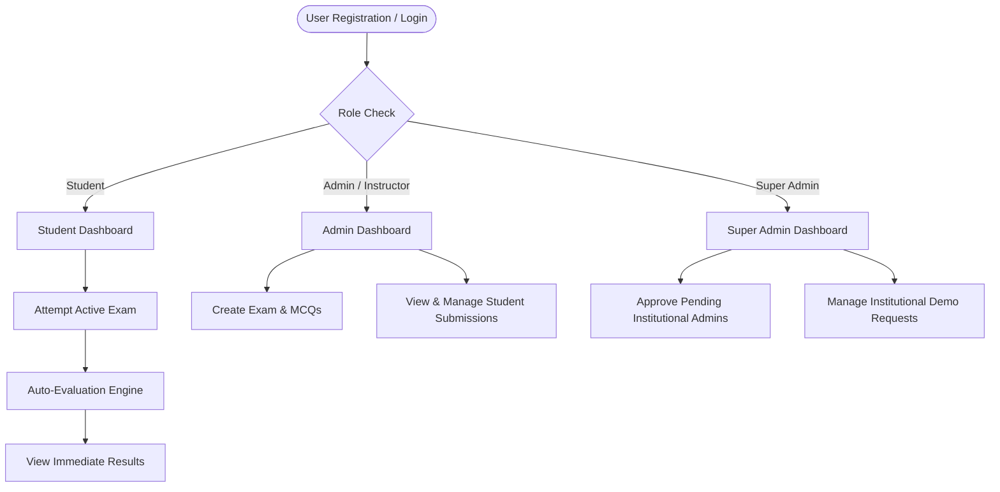

# Examin - Online Examination System

Comprehensive documentation for the **Examin** platform, detailing system architecture, user workflows, database models, API specifications, and deployment guidelines.

---

## 📌 Project Overview

**Examin** is a full-stack web application designed for institutions to conduct online examinations with real-time timer tracking, automated MCQ evaluation, role-based security, and institutional onboarding.

### Tech Stack
* **Frontend**: React 18, React Router v6, Axios, Lucide React, React Toastify
* **Backend**: Node.js, Express.js, MongoDB (Mongoose ODM)
* **Authentication**: JWT (JSON Web Tokens), bcryptjs password hashing
* **Deployment & Tooling**: Express-validator, CORS, Nodemailer (SMTP email integration)

---

## 📂 Project Directory & File Structure

```
examin/
├── backend/                        # Node.js / Express Server
│   ├── controllers/                # Request handling logic
│   │   ├── authController.js       # Registration, login, credential change & approvals
│   │   ├── examController.js       # Exam creation, editing, deletion & retrieval
│   │   └── submissionController.js # Auto-evaluation engine & score processing
│   ├── middleware/                 # Route guards & security
│   │   └── auth.js                 # JWT token verification & role authorization
│   ├── models/                     # Mongoose database schemas
│   │   ├── Exam.js                 # Exam structure & question marks
│   │   ├── Schedule.js             # Institutional demo schedule requests
│   │   ├── Submission.js           # Student test results & selected options
│   │   └── User.js                 # User profile, role & approval status
│   ├── routes/                     # REST API endpoints
│   │   ├── auth.js                 # Authentication routes
│   │   ├── exams.js                # Exam management routes
│   │   ├── schedules.js            # Institutional schedule request routes
│   │   └── submissions.js          # Submission & evaluation routes
│   ├── package.json                # Backend dependencies
│   └── server.js                   # Express application entry point
│
├── frontend/                       # React 18 Web Application
│   ├── public/                     # Public HTML template & icons
│   ├── src/
│   │   ├── api/                    # API integration service
│   │   │   └── index.js            # Axios client with interceptors
│   │   ├── components/             # Reusable UI components
│   │   │   ├── LoadingSpinner.js   # Global loading animation
│   │   │   └── Navbar.js           # Responsive header navigation
│   │   ├── context/                # Global React State
│   │   │   └── AuthContext.js      # User auth state & session management
│   │   ├── pages/                  # Route views
│   │   │   ├── AdminDashboard.js   # Instructor/Admin control panel
│   │   │   ├── AdminLogin.js       # Administrative login page
│   │   │   ├── CreateExam.js       # Exam builder with MCQ management
│   │   │   ├── Dashboard.js        # Role router page
│   │   │   ├── ExamAttempt.js      # Live exam attempt & countdown timer
│   │   │   ├── ExamResults.js      # Student result analytics & scorecards
│   │   │   ├── Home.js             # Landing page & demo request form
│   │   │   ├── Login.js            # Generic login view
│   │   │   ├── Register.js         # Student registration form
│   │   │   ├── StudentDashboard.js # Student portal & available exams
│   │   │   ├── StudentLogin.js     # Student login via ID
│   │   │   ├── SuperAdminDashboard.js # Master system administration
│   │   │   └── ViewSubmissions.js # Submission management & deletion table
│   │   ├── utils/                  # Helper utilities
│   │   │   └── helpers.js          # Date, duration & grade formatters
│   │   ├── App.js                  # React Router navigation tree
│   │   ├── index.css               # Design system & CSS styling
│   │   └── index.js                # Application render entry point
│   └── package.json                # Frontend dependencies
│
├── EXAMIN_SUMMARY.md               # Complete system documentation
└── render.yaml                     # Render deployment configuration
```
# 🚀 Examin – AI-Powered Online Examination Platform

Examin is a modern, secure, and intelligent online examination platform designed for educational institutions. It provides AI-assisted proctoring, real-time monitoring, comprehensive analytics, and an intuitive exam experience for students, teachers, and administrators.

---

# ✨ Features

## 🛡️ AI Proctoring & Anti-Cheating

Ensure examination integrity with built-in security mechanisms.

- **Full-Screen Enforcement**
  - Detects when students exit full-screen mode.
  - Logs violations automatically.

- **Tab & Window Monitoring**
  - Detects browser tab switching.
  - Tracks window focus loss.
  - Records every violation with timestamps.

- **Cheating Prevention**
  - Disables:
    - Right-click context menu
    - Copy (`Ctrl + C`)
    - Paste (`Ctrl + V`)
    - Cut (`Ctrl + X`)
    - Developer tools (`F12`)
    - Text selection

- **Automatic Disqualification**
  - Configurable warning limit.
  - Automatically submits and locks the exam after exceeding the allowed number of violations.

- **Activity Logs**
  - Maintains detailed proctoring logs for every suspicious action.

---

## 👨‍🎓 Student Portal

A distraction-free examination environment.

### Authentication

- Secure token-based login
- Institution-specific access control

### Examination Interface

- Live countdown timer
- Question palette navigation
- Auto-save functionality
- Responsive exam layout

### Supported Question Types

- Single Choice (MCQ)
- Multiple Choice (Checkbox)
- Short Text Answer

### Auto Submission

- Periodically saves answers
- Prevents data loss during network interruptions
- Automatic submission when the timer expires

### Result & Analytics

Students can view:

- Total Score
- Percentage
- Correct Answers
- Incorrect Answers
- Detailed Answer Explanations

---

## 👨‍🏫 Teacher & Admin Dashboard

Powerful tools for managing examinations.

### Exam Management

- Create exams
- Set duration
- Passing marks
- Subject categorization
- Start & end schedules

### Question Bank

- Add unlimited questions
- Assign marks
- Multiple question types
- Answer explanations

### Submission Monitoring

- View submissions in real time
- Search by:
  - Student Name
  - Roll Number
  - Score

### Reports

- Class performance
- Pass/Fail statistics
- Student attempt history

### Submission Management

- Delete invalid or duplicate submissions

---

## 👑 Super Admin Panel

Complete platform management.

### Dashboard Analytics

- Total Users
- Total Exams
- Total Submissions
- System Health

### User Management

- Student Accounts
- Teacher Accounts
- Admin Roles
- Role-Based Access Control (RBAC)

### Platform Configuration

- Institution settings
- Security rules
- Proctoring configuration
- Global platform parameters

---

## 🎨 Modern UI & Responsive Design

Designed for an excellent user experience across all devices.

### Responsive Breakpoints

| Device | Width |
|---------|------:|
| Mobile | 320px – 480px |
| Large Mobile / Tablet | 481px – 768px |
| Tablet | 769px – 1024px |
| Desktop | 1025px+ |

### Mobile Optimizations

- 44px+ touch targets
- 16px input font size (prevents iOS zoom)
- Responsive navigation drawer
- Mobile-friendly layouts

### UI Highlights

- Glassmorphism design
- Smooth animations
- Typewriter hero section
- Clean dashboards
- Modern card layouts
- Consistent design system

---

# 🔒 Security Highlights

- JWT Authentication
- Protected Routes
- Role-Based Access Control
- Auto Logout
- Secure Token Validation
- Anti-Cheating Detection
- Auto Submission
- Activity Logging

---

# 📊 Key Modules

- Student Portal
- Teacher Dashboard
- Admin Dashboard
- Super Admin Panel
- Question Bank
- Exam Engine
- AI Proctoring System
- Analytics & Reports

---

# 🎯 Core Objectives

- Secure online examinations
- Reduce cheating using AI-assisted monitoring
- Simplify exam management
- Improve assessment accuracy
- Deliver a seamless user experience
---

## 👥 User Roles & Access Control



### 1. Student
* **Registration**: Auto-approved upon registration; assigned a unique 11-digit Student ID.
* **Capabilities**: Browse active exams for their institution, attempt timed exams, select MCQ options, auto-submit on countdown completion, and view detailed personal result analytics.

### 2. Admin (Institutional / Instructor)
* **Registration**: Requires Super Admin approval or automatic account creation via confirmed demo schedule requests.
* **Capabilities**: Create & manage exams, define start/end dates and durations, add MCQs with marks, view institutional student submissions, and delete submissions.

### 3. Super Admin
* **Access**: Master administrative access for platform oversight (`admin@examin.com`).
* **Capabilities**: Approve pending institutional sub-admins, manage institutional demo requests, review platform-wide exam submissions, and provision admin accounts via automated email credentials.

---

## 🗄️ Database Schemas

### User Schema (`models/User.js`)
| Field | Type | Description |
| :--- | :--- | :--- |
| `name` | String | Full name (required) |
| `email` | String | Unique email address (required) |
| `studentId` | String | Unique 11-digit Student/Admin ID |
| `password` | String | Hashed password (bcrypt) |
| `role` | String | Enum: `student`, `admin`, `superadmin` |
| `institution` | String | Associated institution |
| `isApproved` | Boolean | True for students/superadmins; requires approval for sub-admins |
| `isActive` | Boolean | Account status toggle |

### Exam Schema (`models/Exam.js`)
| Field | Type | Description |
| :--- | :--- | :--- |
| `title` | String | Exam title |
| `subject` | String | Subject/Course name |
| `duration` | Number | Time limit in minutes |
| `totalMarks` | Number | Auto-calculated sum of question marks |
| `questions` | Array | MCQ objects (`question`, `options`, `isCorrect`, `marks`) |
| `createdBy` | ObjectId | Reference to `User` |
| `startDate` | Date | Exam window start time |
| `endDate` | Date | Exam window end time |
| `isActive` | Boolean | Status toggle |

### Submission Schema (`models/Submission.js`)
| Field | Type | Description |
| :--- | :--- | :--- |
| `student` | ObjectId | Reference to `User` |
| `exam` | ObjectId | Reference to `Exam` |
| `answers` | Array | Selected option indices & evaluation results |
| `totalScore` | Number | Achieved score |
| `percentage` | Number | Calculated percentage score |
| `timeTaken` | Number | Duration in minutes |

---

## ⚡ API Endpoints

### Authentication (`/api/auth`)
* `POST /api/auth/register` — Register a new student or admin
* `POST /api/auth/login` — Login with Email / Student ID and password
* `GET /api/auth/me` — Fetch authenticated user profile
* `GET /api/auth/pending-admins` — Fetch unapproved admin accounts *(Admin/SuperAdmin)*
* `PUT /api/auth/approve-admin/:id` — Approve sub-admin *(SuperAdmin)*

### Exams (`/api/exams`)
* `GET /api/exams` — List available exams
* `GET /api/exams/:id` — Get single exam details
* `POST /api/exams` — Create a new exam *(Admin only)*
* `PUT /api/exams/:id` — Update exam details *(Admin only)*
* `DELETE /api/exams/:id` — Delete an exam *(Admin only)*

### Submissions (`/api/submissions`)
* `POST /api/submissions` — Submit exam answers & trigger auto-grading *(Student)*
* `GET /api/submissions/my` — Fetch student's test history *(Student)*
* `GET /api/submissions` — Fetch all submissions *(Admin only)*
* `DELETE /api/submissions/:id` — Delete a submission *(Admin only)*

### Schedules (`/api/schedules`)
* `POST /api/schedules` — Request institutional test schedule *(Public)*
* `GET /api/schedules` — List schedule requests *(Admin/SuperAdmin)*
* `PUT /api/schedules/:id` — Confirm request & provision Admin account *(SuperAdmin)*

---

## 🛠️ Quick Start & Development

### 1. Backend Setup
```bash
cd backend
npm install
npm run dev
```
Runs on `http://localhost:5000`

### 2. Frontend Setup
```bash
cd frontend
npm install
npm start
```
Runs on `http://localhost:3000`

---

## ✅ Quality & Build Status

* **Backend**: Clean Node.js syntax with 0 errors across all routes and controllers.
* **Frontend**: Production build verified with **0 warnings and 0 errors**.
