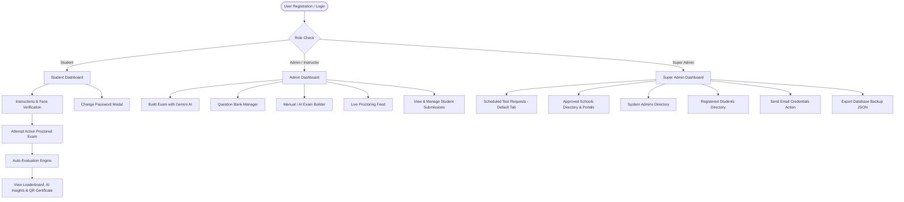

# Examin - Online Examination & Assessment System 🎓


Comprehensive documentation for the **Examin** platform, detailing system architecture, user roles, proctoring security, database models, Google Gemini AI exam generation, API specifications, and deployment guidelines.

---

## 📌 Project Overview

**Examin** is an enterprise-grade full-stack web application designed for educational institutions, schools, and corporate certifiers to conduct secure online examinations. It features **real-time Google Gemini AI question generation**, **AI-assisted exam builder**, **automated MCQ grading**, **leaderboard rankings**, **printable QR certificates**, **live proctor monitoring**, **Registered Students directory**, **Connected Institution Portals**, and **Super Admin platform governance**.

---

## ✨ Features & Capabilities

### 🛡️ Proctoring & Anti-Cheating Suite
* **Anti-Chrome Extension Defense**: 3-layer security system using capturing-phase event listeners (`useCapture = true`, `stopImmediatePropagation()`) to intercept events before Chrome extensions (e.g. *Absolute Enable Right Click & Copy*) can run content scripts.
* **Text Selection Wiper**: Real-time `selectionchange` listener invoking `window.getSelection().removeAllRanges()` to immediately un-highlight text if an extension forces CSS `user-select: text !important`.
* **Clipboard Data Poisoning**: Automatically overwrites hijacked copy payloads with security warning text (`[SECURITY VIOLATION]: Question text copying is prohibited...`).
* **Debounced Dual Tab & Window Blur Detection**: Detects browser tab switching (`visibilitychange`) and application/window switching (`window.blur`) with real-time header violation badge (`Tab Switches: X/3`).
* **Keyboard Shortcut & Screenshot Blocking**: Intercepts `PrintScreen`, `F12`, `Ctrl+Shift+I/J/C`, `Ctrl+P`, `Ctrl+U`, `Ctrl+C`, `Ctrl+V`, `Ctrl+X`, `Ctrl+A`, `Ctrl+S`.
* **Live Proctor Monitoring Feed**: Real-time instructor view (`/admin/live-monitoring`) for active exam tracking.

### ⏱️ Live Real-Time Countdown Timer Engine
* **Freeze-Proof Timer Engine**: Calculates exact remaining seconds dynamically from `new Date()` vs `examStartTime` every 1000ms, eliminating timer freezing, pauses, or drift.
* **Sub-Second Auto-Save**: Background answer auto-saving to `localStorage` every 800ms with live visual indicator (`Auto-saved`).

### 🤖 Google Gemini AI Exam Builder
* Real-time AI question generator powered by Google Gemini (`/api/ai-exam/generate`) allowing instant test creation by topic prompt (*Python, Data Structures, Maths, Science, History, etc.*).
* Automatic fallback generator for continuous availability.
* Editable generated questions, options, correct answers, and assigned marks.

### 🏫 Approved Schools & Connected Institution Portals
* **Approved Schools Directory**: Grid of active schools showing connected student count, exam count, and school admin.
* **Connected Institution Portal Modal**: Interactive inspector modal allowing superadmins to open any approved school to inspect connected students, exams, and school admins.
* **Delete School Action**: One-click deletion of approved institutions and purge of associated records.

### 👤 Student Directory & Credential Mailer
* **Registered Students Directory**: Comprehensive directory listing Student Name, Email Address, 11-digit Student ID, Assigned Institution, and Registration Date.
* **Automated Credentials Dispatcher**: Instant email dispatch of 11-digit Student ID and Password upon registration via Gmail SMTP.
* **Send Email Credentials Button**: In-dashboard button in the Registered Students table allowing superadmins to re-send login credentials via email at any time.

### 🔐 Student & Admin Password Management
* **Change Password Modal**: Secure password update tool on Student Dashboard (`/student-dashboard`) with live validation.
* Sub-Admin password & credential management directly from Admin Dashboard.

### 📚 Question Bank & Redesigned Exam Results
* Centralized question bank with category tags, difficulty filters (Easy, Medium, Hard), and bulk CSV/JSON import capabilities.
* **Redesigned Exam Results UI**: Clean flexbox card layout featuring high-contrast score cards, test duration, letter grade badges (A/B/C/D/F), pass/fail status pills, and full-width AI performance feedback breaking down strengths and weakness recommendations.

### 📜 Printable QR Certificates
* Automatic PDF/Printable certificate generation for passing candidates, complete with scannable QR verification link (`/verify-certificate/:certId`).

### 📊 Super Admin Command Center
* **Organized Dashboard Tabs**:
  1. 📅 **Scheduled Test Requests** (Default #1 Tab)
  2. 🏫 **Approved Schools**
  3. 🛡️ **System Admins** (`👑 Super Admin Only` badge styling)
  4. 👤 **Registered Students**
  5. 📖 **All Platform Exams**
* Live platform analytics (total users, exams, pass rate %, active subscriptions), system audit logs, institutional request approval workflow, and database JSON backup export.

---

## 🔒 Security & Compliance

* **JWT Authentication**: Secure JSON Web Tokens stored with session management.
* **Role-Based Access Control (RBAC)**: Strict role separation between Students, Admins/Instructors, and Super Admin (`/api/superadmin/*` protected).
* **Proctoring Audit Trail**: Every tab switch, window blur, copy attempt, and proctor flag recorded in submission records.
* **Database Encryption & Hashing**: Bcrypt password hashing (12 rounds) and sanitized inputs via express-validator.

---

## 🚀 Complete 10-Step Workflow

1. **Institution Onboarding**: Demo Request -> Super Admin Approval -> Automated Credentials Email with 11-digit Admin ID.
2. **Admin & Student Password Management**: Sub-Admins and Students can update passwords directly via the **Change Password** panel.
3. **AI Exam Creation**: Topic Prompt -> Google Gemini AI Generator -> Auto-populated Questions -> Editable Question List -> Schedule & Publish.
4. **Student Exam Workflow**: Pre-exam Instructions -> Face Verification -> Timed Exam with Live Countdown & 800ms Auto-Save -> Auto-Submit -> QR Certificate.
5. **Result & Analytics**: Auto Evaluation -> Rank Generation -> AI Strengths & Weakness Analysis.
6. **Question Bank**: Categories -> CSV Import -> Difficulty Filters -> Random Question Selection.
7. **Proctoring Workflow**: Camera Permission -> Face Detection -> Debounced Tab/Blur Counter -> Anti-Extension Copy/Paste Block.
8. **Notification Workflow**: In-App Dashboard Alerts & Automated Email notifications.
9. **Super Admin Workflow**: Manage Scheduled Test Requests -> Approve Sub-Admins -> Inspect Connected Institution Portals -> Manage Registered Students -> Platform Analytics -> Audit Logs -> JSON Backup.
10. **Certificate Workflow**: Pass Exam -> Printable PDF Certificate -> QR Verification Code.

---

## 📂 Project Directory & File Structure

```
examin/
├── .github/                        # CI/CD Workflows
│   └── workflows/
│       └── ci.yml                  # GitHub Actions CI build & verification pipeline
│
├── backend/                        # Node.js / Express Server
│   ├── controllers/                # Request handling logic
│   │   ├── authController.js       # Registration, login, password change & credential management
│   │   ├── certificateController.js# Certificate generation & QR verification
│   │   ├── examController.js       # Exam creation, editing, deletion & retrieval
│   │   ├── questionBankController.js# Question bank CRUD, CSV import & AI generation
│   │   ├── submissionController.js # Auto-evaluation, rank calculation & AI analysis
│   │   └── superAdminController.js # Analytics, audit logs, student directory & backup
│   ├── middleware/                 # Route guards & security
│   │   └── auth.js                 # JWT token verification & role authorization
│   ├── models/                     # Mongoose database schemas
│   │   ├── AuditLog.js             # System action audit trail
│   │   ├── Certificate.js          # Issued certificate & verification hash
│   │   ├── Exam.js                 # Exam structure, proctoring & passing marks
│   │   ├── Institution.js          # Institutional subscription plan & limits
│   │   ├── Notification.js         # User dashboard notification alerts
│   │   ├── QuestionBank.js         # Question bank categories, difficulty & options
│   │   ├── Schedule.js             # Institutional demo schedule requests
│   │   ├── Submission.js           # Student test results, proctor logs & AI analysis
│   │   └── User.js                 # User profile, role, 11-digit Student ID & approval status
│   ├── routes/                     # REST API endpoints
│   │   ├── aiExam.js               # Google Gemini AI exam generator API
│   │   ├── auth.js                 # Authentication & password management routes
│   │   ├── certificates.js         # Certificate & verification routes
│   │   ├── exams.js                # Exam management routes
│   │   ├── notifications.js        # Notification routes
│   │   ├── questionBank.js         # Question bank & AI generator routes
│   │   ├── schedules.js            # Institutional schedule request & approval routes
│   │   ├── submissions.js          # Submission & leaderboard routes
│   │   └── superAdmin.js           # Super admin analytics, student directory & backup routes
│   ├── .env.example                # Environment variables template (no secrets)
│   ├── package.json                # Backend dependencies
│   └── server.js                   # Express application entry point
│
├── frontend/                       # React 18 Web Application
│   ├── public/                     # Public HTML template & icons
│   ├── src/
│   │   ├── api/                    # API integration service
│   │   │   ├── axios.js            # Axios configuration with auth headers
│   │   │   └── index.js            # API methods (authAPI, examAPI, superAdminAPI, etc.)
│   │   ├── components/             # Reusable UI components
│   │   │   ├── CertificateModal.js # PDF / Canvas Printable Certificate with QR Code
│   │   │   ├── ExaminLogo.js       # Platform logo icon
│   │   │   ├── LoadingSpinner.js   # Global loading animation
│   │   │   └── Navbar.js           # Responsive header navigation & Dark mode toggle
│   │   ├── context/                # Global React State
│   │   │   ├── AuthContext.js      # User auth state & session management
│   │   │   └── ThemeContext.js     # Dark Mode / Light Mode persistent theme
│   │   ├── pages/                  # Route views
│   │   │   ├── AdminDashboard.js   # Instructor control panel & password tool
│   │   │   ├── AdminLogin.js       # Administrative login page with top-right Close (✕)
│   │   │   ├── CertificateVerify.js# Public QR Code Certificate verification portal
│   │   │   ├── CreateExam.js       # Dual-mode Exam Builder (Manual & Gemini AI Generator)
│   │   │   ├── Dashboard.js        # Role routing handler
│   │   │   ├── ExamAttempt.js      # Instructions, Face Verify & Live Exam with proctoring
│   │   │   ├── ExamResults.js      # Leaderboard, AI Insights & Certificate download
│   │   │   ├── Home.js             # Landing page & demo request form
│   │   │   ├── LiveMonitoring.js   # Admin real-time exam attempt proctoring feed
│   │   │   ├── Login.js            # Generic login view
│   │   │   ├── PricingPlans.js     # Pricing plans, checkout modal & invoice download
│   │   │   ├── QuestionBank.js     # Question bank manager, CSV import & AI generator
│   │   │   ├── Register.js         # Student registration form with credential notice
│   │   │   ├── StudentDashboard.js # Student portal, available exams & Change Password modal
│   │   │   ├── StudentLogin.js     # Student login via Student ID with top-right Close (✕)
│   │   │   ├── SuperAdminDashboard.js # Master governance, portals, directory & schedules
│   │   │   └── ViewSubmissions.js # Submission management & deletion table
│   │   ├── utils/                  # Helper utilities
│   │   │   └── helpers.js          # Date formatting, score calculation & grade letters
│   │   ├── App.js                  # React Router navigation tree
│   │   ├── index.css               # Design system & CSS styling
│   │   └── index.js                # Application render entry point
│   └── package.json                # Frontend dependencies
│
├── README.md                       # Comprehensive system documentation
└── render.yaml                     # Render deployment configuration
```

---

## 👥 User Roles & Architecture



---

## ⚡ Key API Endpoints

### AI Exam Builder (`/api/ai-exam`)
* `POST /api/ai-exam/generate` — Generate structured MCQs using Google Gemini AI or internal AI engine

### Question Bank (`/api/question-bank`)
* `GET /api/question-bank` — List and filter questions by category/difficulty
* `POST /api/question-bank` — Add new question
* `POST /api/question-bank/import` — Bulk import questions via JSON/CSV

### Authentication (`/api/auth`)
* `PUT /api/auth/change-password` — Change password for authenticated users (Students & Admins)
* `PUT /api/auth/change-credentials` — Update password & Admin ID for sub-admins
* `GET /api/auth/admins` — Fetch all system administrators with formatted 11-digit Admin IDs

### Super Admin & Directory (`/api/superadmin`)
* `GET /api/superadmin/students` — Fetch registered student directory
* `DELETE /api/superadmin/students/:id` — Delete student account
* `POST /api/superadmin/students/:id/resend-credentials` — Dispatch credentials email to student
* `DELETE /api/superadmin/institution/:name` — Delete approved school and associated records

---

## 🛠️ Environment Configuration & Setup

### Environment Variables Template (`backend/.env`)

> [!IMPORTANT]
> Never commit actual API keys, database credentials, or email passwords to version control. Use `.env` locally.

```env
# Server Configuration
NODE_ENV=development
PORT=5000

# Database
MONGODB_URI=mongodb+srv://<username>:<password>@<cluster>.mongodb.net/examin?retryWrites=true

# JWT Secret
JWT_SECRET=your_jwt_secret_key_here

# Email Configuration (Gmail SMTP)
SMTP_HOST=smtp.gmail.com
SMTP_PORT=587
SMTP_USER=your_email@gmail.com
SMTP_PASS=your_gmail_app_password_here

# Google Gemini AI API Key
GEMINI_API_KEY=your_google_gemini_api_key_here
```

---

## 🚀 Quick Start & Development

### 1. Backend Setup
```bash
cd backend
npm install
npm run dev
```
Runs on `http://localhost:5000`

### 2. Frontend Setup
```bash
cd frontend
npm install
npm start
```
Runs on `http://localhost:3000`

---

## ✅ Quality & Build Status

* **CI/CD Pipeline**: Configured with GitHub Actions (`.github/workflows/ci.yml`).
* **Backend API**: Node.js / Express API fully operational with Google Gemini AI integration.
* **Frontend App**: Production React 18 build verified with zero errors.

---

### 🔮 Roadmap & Upcoming Features
* 📱 Native Mobile App Integration (React Native)
* 🌐 Multi-language Exam Translations
* ⚡ Automated Essay / Subjective AI Grading
