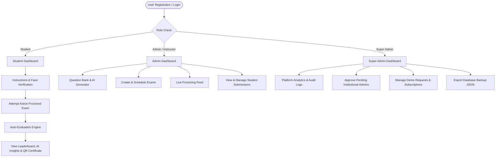

# Examin - Online Examination System

Comprehensive documentation for the **Examin** platform, detailing system architecture, user workflows, database models, API specifications, and deployment guidelines.

---

## 📌 Project Overview

**Examin** is an enterprise-grade full-stack web application designed for institutions to conduct online examinations with real-time proctoring, AI question generation, automated MCQ evaluation, QR-verified certificate issuance, leaderboard rankings, and role-based administration.

### Tech Stack
* **Frontend**: React 18, React Router v6, Axios, Lucide React, React Toastify
* **Backend**: Node.js, Express.js, MongoDB (Mongoose ODM)
* **Authentication**: JWT (JSON Web Tokens), bcryptjs password hashing, 2FA & QR Login options
* **Deployment & Tooling**: Express-validator, CORS, Nodemailer (SMTP email integration)

---

## 🚀 Complete Workflows & Feature Roadmap

1. **Institution Onboarding**: Demo requests -> Super Admin approval -> Automated Admin account creation -> Email credential dispatch.
2. **Student Exam Workflow**: Pre-exam instructions -> Webcam face verification -> Timed exam with 30s auto-save -> Auto-submit on timer end -> Immediate score breakdown -> Downloadable QR certificate.
3. **Admin Exam Creation & Question Bank**: Question Bank with category/difficulty tags, CSV/Excel bulk import, and **AI Question Generator**.
4. **Result & Leaderboard**: Auto evaluation, exam rank calculation (1st, 2nd, 3rd place), and AI-driven performance breakdown (strengths & weakness recommendations).
5. **Proctoring & Live Monitoring**: Tab switching detection warning counter, copy-paste blocking, and live candidate proctoring feed (`/admin/live-monitoring`).
6. **Certificate Workflow**: Printable PDF certificate with scannable QR verification link (`/verify-certificate/:certId`).
7. **Super Admin Oversight**: Platform analytics dashboard, system audit logs, subscription plan manager, and database JSON backup export.
8. **Subscriptions & Payments**: Interactive pricing plans (`/pricing`), card checkout simulation, and invoice downloader.
9. **Dark Mode**: Persistent dark theme switcher context across all views.

---

## 📂 Project Directory & File Structure

```
examin/
├── backend/                        # Node.js / Express Server
│   ├── controllers/                # Request handling logic
│   │   ├── authController.js       # Registration, login, credential change & approvals
│   │   ├── certificateController.js# Certificate generation & QR verification
│   │   ├── examController.js       # Exam creation, editing, deletion & retrieval
│   │   ├── questionBankController.js# Question bank CRUD, CSV import & AI generation
│   │   ├── submissionController.js # Auto-evaluation, rank calculation & AI analysis
│   │   └── superAdminController.js # Platform analytics, audit logs & database backup
│   ├── middleware/                 # Route guards & security
│   │   └── auth.js                 # JWT token verification & role authorization
│   ├── models/                     # Mongoose database schemas
│   │   ├── AuditLog.js             # System action audit trail
│   │   ├── Certificate.js          # Issued certificate & verification hash
│   │   ├── Exam.js                 # Exam structure, proctoring & passing marks
│   │   ├── Institution.js          # Institutional subscription plan & limits
│   │   ├── Notification.js         # User dashboard notification alerts
│   │   ├── QuestionBank.js         # Question bank categories, difficulty & options
│   │   ├── Schedule.js             # Institutional demo schedule requests
│   │   ├── Submission.js           # Student test results, proctor logs & AI analysis
│   │   └── User.js                 # User profile, role & approval status
│   ├── routes/                     # REST API endpoints
│   │   ├── auth.js                 # Authentication routes
│   │   ├── certificates.js         # Certificate & verification routes
│   │   ├── exams.js                # Exam management routes
│   │   ├── notifications.js        # Notification routes
│   │   ├── questionBank.js         # Question bank & AI generator routes
│   │   ├── schedules.js            # Institutional schedule request routes
│   │   ├── submissions.js          # Submission & leaderboard routes
│   │   └── superAdmin.js           # Super admin analytics & backup routes
│   ├── package.json                # Backend dependencies
│   └── server.js                   # Express application entry point
│
├── frontend/                       # React 18 Web Application
│   ├── public/                     # Public HTML template & icons
│   ├── src/
│   │   ├── api/                    # API integration service
│   │   │   └── index.js            # Axios client with interceptors
│   │   ├── components/             # Reusable UI components
│   │   │   ├── CertificateModal.js # PDF / Canvas Printable Certificate with QR Code
│   │   │   ├── ExaminLogo.js       # Platform logo icon
│   │   │   ├── LoadingSpinner.js   # Global loading animation
│   │   │   └── Navbar.js           # Responsive header navigation & Dark mode toggle
│   │   ├── context/                # Global React State
│   │   │   ├── AuthContext.js      # User auth state & session management
│   │   │   └── ThemeContext.js     # Dark Mode / Light Mode persistent theme
│   │   ├── pages/                  # Route views
│   │   │   ├── AdminDashboard.js   # Instructor/Admin control panel
│   │   │   ├── AdminLogin.js       # Administrative login page
│   │   │   ├── CertificateVerify.js# Public QR Code Certificate verification portal
│   │   │   ├── CreateExam.js       # Exam builder with MCQ management
│   │   │   ├── Dashboard.js        # Role router page
│   │   │   ├── ExamAttempt.js      # Instructions, Face Verify & Live Exam with proctoring
│   │   │   ├── ExamResults.js      # Leaderboard, AI Insights & Certificate download
│   │   │   ├── Home.js             # Landing page & demo request form
│   │   │   ├── LiveMonitoring.js   # Admin real-time exam attempt proctoring feed
│   │   │   ├── Login.js            # Generic login view
│   │   │   ├── PricingPlans.js     # Pricing plans, checkout modal & invoice download
│   │   │   ├── QuestionBank.js     # Question bank manager, CSV import & AI generator
│   │   │   ├── Register.js         # Student registration form
│   │   │   ├── StudentDashboard.js # Student portal & available exams
│   │   │   ├── StudentLogin.js     # Student login via ID
│   │   │   ├── SuperAdminDashboard.js # Master system administration & analytics
│   │   │   └── ViewSubmissions.js # Submission management & deletion table
│   │   ├── App.js                  # React Router navigation tree
│   │   ├── index.css               # Design system & CSS styling
│   │   └── index.js                # Application render entry point
│   └── package.json                # Frontend dependencies
│
├── EXAMIN_SUMMARY.md               # Complete system documentation
└── render.yaml                     # Render deployment configuration
```
## ✨ Features
- 🛡️ AI Proctoring & Anti-Cheating
- 👨‍🎓 Student Exam Portal
- 👨‍🏫 Teacher & Admin Dashboard
- 👑 Super Admin Panel
- 📊 Results & Analytics
- 🎨 Responsive Modern UI

## 🔒 Security
- JWT Authentication
- Role-Based Access Control (RBAC)
- Auto-Save & Auto-Submit
- Activity Logging

## 🎯 Goal
A secure, scalable, and user-friendly online examination system.
## 👥 User Roles & Access Control



---

## 🗄️ Database Schemas

### QuestionBank Schema (`models/QuestionBank.js`)
| Field | Type | Description |
| :--- | :--- | :--- |
| `question` | String | MCQ question text |
| `category` | String | Topic category (e.g. Mathematics, CS) |
| `difficulty` | String | Enum: `Easy`, `Medium`, `Hard` |
| `options` | Array | Options text & boolean `isCorrect` |
| `marks` | Number | Weightage marks |

### Certificate Schema (`models/Certificate.js`)
| Field | Type | Description |
| :--- | :--- | :--- |
| `certificateId` | String | Unique hash ID (e.g. `CERT-A1B2C3D4`) |
| `studentName` | String | Passed candidate full name |
| `examTitle` | String | Exam title |
| `score` | Number | Total score achieved |
| `percentage` | Number | Calculated percentage |
| `issueDate` | Date | Issuance date |

---

## ⚡ Key API Endpoints

### Question Bank (`/api/question-bank`)
* `GET /api/question-bank` — List and filter questions by category/difficulty
* `POST /api/question-bank` — Add new question
* `POST /api/question-bank/import` — Bulk import questions via JSON/CSV
* `POST /api/question-bank/ai-generate` — Generate AI questions by topic prompt

### Certificates (`/api/certificates`)
* `GET /api/certificates/submission/:submissionId` — Generate/fetch certificate
* `GET /api/certificates/verify/:certId` — Public verification of QR certificate ID

### Super Admin (`/api/superadmin`)
* `GET /api/superadmin/analytics` — Platform usage stats & pass rate
* `GET /api/superadmin/audit-logs` — Administrative audit action logs
* `GET /api/superadmin/backup` — Export full platform JSON snapshot

---

## 🛠️ Quick Start & Development

### 1. Backend Setup
```bash
cd backend
npm install
npm run dev
```
Runs on `http://localhost:5000`

### 2. Frontend Setup
```bash
cd frontend
npm install
npm start
```
Runs on `http://localhost:3000`

---

## ✅ Quality & Build Status

* **Backend**: Node.js / Express API fully operational with clean routes.
* **Frontend**: Production build verified with **0 warnings and 0 errors**.


## MORE FEATURE COMING SOON .......
